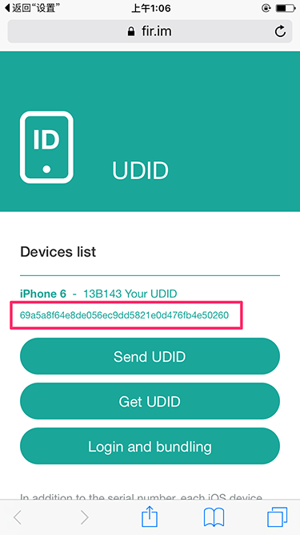

# Using fir to install iOS app

This mansual will describe how to install internal build of iOS app on your device.

## What is fir?

[fir](http://fir.im/) is a web service for in-house app distribution. We'll use it to download and install the testing build internally.

## What is UDID?

`UDID` is short for **U**nique **D**evice **ID**entifier of an iPhone or iPad. To install the app which is not released to App Store on your device, you have to provide `UDID` to developers first.

After you provide the `UDID`, developers have to embed it to the app, recompile and then upload a new one for installing.

Without corresponding `UDID` embedded, a device has no permission to install that app.

## Install profile and get UDID

**Step 1**: Open [http://fir.im/udid](http://fir.im/udid) in `Safari` app on your `iPhone`. If you haven't used it before, the page may look like this:

**Step 2**: Tap `Get UDID` button and it will switch to system settings page:

**Step 3**: Tap `Install` button on upper-right corner, the system may ask you to confirm with iPhone password. Input it and then tap `Install`.

It will switch back to `Safari` and if everything works well you will see:

In the screenshot above, that long alphanumeric text in red border is the `UDID` we need.

## Send UDID

Tap `Send UDID` button and send it to the developer team.

## Download and install the app

When the app is uploaded to fir by developers, a short URL like `http://fir.im/ab12` will be generated, and be the permanant link of the app. 

Open that link in `Safari`, tap `Download` button and then `OK`. The app will start to be downloaded and installed on your iPhone, just as it is from App Store.

Everytime the app updated, you could just open the same link and perform the actions as before. The app on your device will be updated.