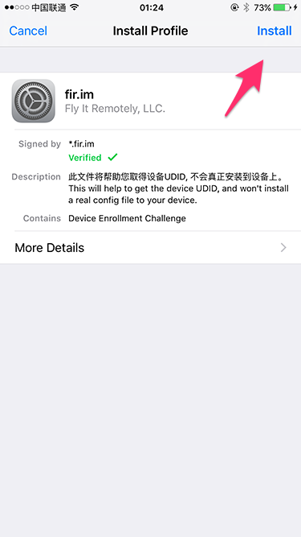

# Using fir to install internal iOS app

This mansual will describe how to install internal build of iOS app on your device.

## What is fir?

[fir](http://fir.im/) is a web service for in-house mobile app distribution. We'll use it to download and install the testing build internally.

## What is UDID?

`UDID` is short for **U**nique **D**evice **ID**entifier of an iPhone or iPad. To install the app which is not released to App Store on your device, you have to provide `UDID` to developers first.

After you provide the `UDID`, developers have to embed it to the app, recompile and then upload a new one for installation.

Without corresponding `UDID` embedded, a device has no permission to install such app.

## Install profile and get UDID

Please follow the steps below to find out `UDID` of your device. The screenshot are captured on English version of fir, under iOS 9. The details may be slightly varied on your device.

**Step 1**: Open [https://fir.im/udid](https://fir.im/udid) in `Safari` app on your `iPhone`. If you haven't used it before, the page may look like this:

**Step 2**: Tap `Get UDID` button and it will switch to system settings page:

**Step 3**: Tap `Install` button on upper-right corner, the system may ask you to confirm with iPhone password. Input it and then tap `Install`.

It will switch back to `Safari` and if everything works well you will see:

In the screenshot above, the long alphanumeric text is the `UDID` we need.

## Send UDID

When the previous steps are finished smoothly, you could always open [https://fir.im/udid](https://fir.im/udid) to view your `UDID`.

To pass your `UDID` to developer team, simply tap `Send UDID` button and send it via email.

## Download and install the app

When the app is uploaded to fir by developers, a short URL like `http://fir.im/ab12` will be generated, and be the permanent link of the app. 

Open that link in your browser, you will see the app page looks like this:

Tap `Download` button and then `Install`. The app will start to be downloaded and installed on your iPhone, just as it is from App Store. You may press home button to find the app icon on your launcher.

## Upgrade the app

Everytime the app updated, you could just open the same link and tap `Download` again. The app on your device will be updated accordingly.
